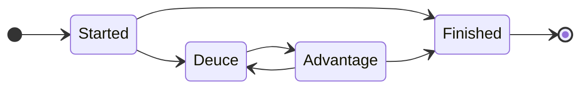
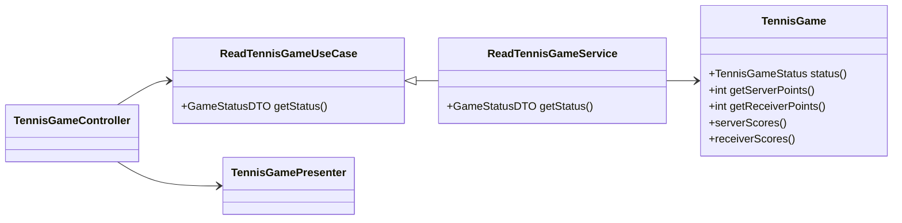

# Tennis Game TDD

## PR 때 나왔던 주제에 대한 노트

- 원래 주제는 TDD 였지만, PR을 통해 생각보다 많은 주제가 폭넓게 논의 됨.
- 개인적으로 아주 재미있는 시간이었고, 강의를 준비하면서 더 명확하게 배울 수 있었음.

### Triangulation

- 테스트를 먼저 실패하게 만들고, 테스트가 통과할 만큼만 구현하고 있나? == Triangulation 을 잘하고 있나?
- 테스트를 실패하게 만든 다음에, 아직 필요하지도 않은 구조를 너무 많이 도입하고 있지 않나?
  - 먼저 모든 기능 구현을 끝내고, 필요할 때 리팩토링을 통해 구조를 도입하면 어떨까?

### 테스트 가독성

- 테스트 실패 -> 성공 사이클에만 집중한 나머지, 테스트 가독성을 놓치고 있지 않나?
- 테스트만 봐도 테스트 대상의 도메인 지식이 잘 드러나나?
- 테스트의 순환 복잡도(Cyclomatic Complexity)가 너무 크지 않나?

### 도메인 모델 상태 정합성

- 도메인 모델의 상태가 언제나 valid 한가?
- 한 번 invalid 한 상태를 허용하면 치러야 하는 비용이 굉장히 큼.
- 테니스 게임의 결과가 100:0이 될 수 있을까? 그런 모델이 비즈니스를 제대로 반영한다고 말할 수 있을까?
- 참조: https://enterprisecraftsmanship.com/posts/always-valid-domain-model/

### 직교, 비직교

- 테니스 게임의 모든 상태는 서버와 리시버의 포인트로만 판단 가능.
- isDeuce 같은 상태 필드는 포인트 필드와 비직교.
- 비직교하는 필드가 있으면 객체의 상태를 일일이 추적해야 하기 때문에 코드 읽기가 괴롭다.
- 참조: https://engineering.linecorp.com/ko/blog/code-readability-vol3/

### Separation of Concerns (SoC)

- 비즈니스 로직과 프레젠테이션 로직의 분리.
- "love all" 문자열을 반환하는 것은 비즈니스 로직이라고 보기 어려움.
- 테니스 코트 안에서 announcing을 위해 읽는 규칙이므로, Presenter로 분리하는 것이 좋음.

### Anemic Domain Model (빈혈 도메인 모델)

- TennisGame 객체는 단순 Data이고, 주요 로직은 Service에 파편화.
- Service, Controller, Component 같은 곳에는 최대한 로직을 넣는 것을 피해야.
  - 테스트 하기 어렵고, 관리하기도 어렵다.
- 비즈니스 규칙은 데이터와 행위가 둘 다 있는 도메인 모델로 구현되어야 함.
- 행위를 적절한 객체에 넣는 것을 너무 일찍 포기하면, 점점 절차형 프로그래밍으로 전락함. (에릭 에반스)

## 게임 상태에 대한 이야기

- 1회차 구현이 생각보다 복잡하다는 생각이 든다면?
- `TDD != "무턱대고 코드부터 짜기"`
- 불명확한 요구 사항을 개발자의 언어로 먼저 정리하는 과정도 필요.
- 게임의 룰과 상태를 그림으로 정리해보기.

## Domain Model and Presenter

- 일반적으로 웹애플리케이션에서 `presenter`는 `domain model`에 직접 의존하지 않음.
- 왜냐하면 `domain model`은 애플리케이션 레이서 내부에서만 사용되고, `presenter`는 애플리케이션 레이어 바깥쪽에 위치하기 때문.
- 트랜잭션 경계는 애플리케이션 서비스를 기준으로 함. 따라서 불변이 아닌 `domain entity`를 컨트롤러에서 쓰는 것은 의도하지 않은 결과를 만들 수 있다.

## 후기 & 예고

- `TennisGame` 클래스의 디자인이 어려웠던 이유?
  - 테니스 게임의 룰과 요구사항만 주어지고, 실제 `TennisGame` 객체를 쓰는 쪽(소비자)가 모호한 상황에서 구현이 시작됨.
  - `TennisGame`은 가장 중요한 비즈니스 로직을 가진 클래스이나, 완전히 격리된 무균실에서 탄생했음.
- 하지만 처음부터 `TennisGame`을 사용할 소비자가 이미 있거나, 리팩토링을 통해 `TennisGame`이 탄생했다면?
  - 이제 *Outside-In TDD* 를 배워 볼 차례.
  - REST API, DB가 있는 현실의 웹개발과 TDD가 만나는 지점.

