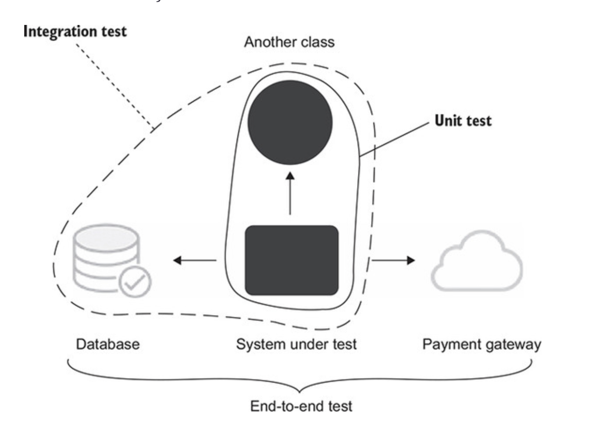
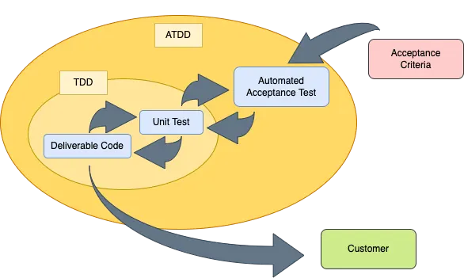

# Outside-In TDD

## Web Application과 TDD

- 테니스 게임을 TDD로 구현해보면서 유닛 테스트를 구현해 봄. (그것도 두 번이나!)
- 그런데 아직 클래스를 쓰는 곳이 없다. 소비자가 불명확.
- 웹 개발자는 REST API도 만들어야 하고, DB에 저장도 해야 함.
  - `Controller`, `Service`, `Repository`는 어디에?
  - 본질적인 복잡성에 집중해서 `TennisGame`클래스를 만든 것은 좋았지만, 무균실에서 탄생한 클래스가 나머지 우발적인 복잡성을 가진 부분(Web, DB 등)과 잘 통합될까?
- 우리가 매일 개발하는 웹 애플리케이션과, 유닛 테스트의 접점은 어디일까?
- 어떻게 해야 토이 프로젝트에서 연습하는 것처럼 실전에서도 TDD를 잘 활용할 수 있을까?

## The Testing Pyramid


- Acceptance Test
  - 전체 시스템이 동작하는지 테스트.
  - "Acceptance Test" == "Functional Test", "Customer Test", "System Test", "UI Test".
  - 필요한 기능 중에 개발이 얼마나 완료 되었는지? - 진척도 측정.
- Integration Test
  - 통제할 수 없는 외부 의존성을 제외하고, 우리의 코드가 잘 동작하는지?
- Unit Test
  - 우리가 만든 클래스나 함수가 정확하게 기대하는대로 일을 하는지?
  - 쓰기 편한지?

## 테스트 대상의 범위



- [Unit Test by Vladimir Khorikov](https://www.aladin.co.kr/shop/wproduct.aspx?ItemId=280870631)

## Outside-In TDD 소개



### Overview

1. 실패하는 Acceptance Test 작성.
   1. 실패하는 Unit Test 작성.
   2. Unit Test 성공하도록 구현
2. 최종적으로 Acceptance Test 성공.

### Details

- Acceptance Test는 Unit Test와는 달리, 최대한 빨리 통과하도록 만들 필요는 없음.
- Collaborator를 찾고 디자인하는 과정에서 London School TDD를 활용.
  - Test Double을 활용해 바깥쪽에서부터 빠르게 Collaborator를 찾아 들어간다.
- 구현을 하지 않으면 더 이상 진행할 수 없을 때 유닛 Unit Test TDD 사이클 진입.
- Unit Test 사이클이 다 끝나면 (== 구현이 끝나면) 필요 없어진 Test Double 제거.

## Outside-In TDD의 혜택

- 거의 공짜나 다름없는 Acceptance Test 그 자체.
  - 구현을 다 하고나서 추가하려면 매우 귀찮음. -> 결국 안하게 됨.
- 유닛 테스트부터 짜는 것의 위험을 원천적으로 막을 수 있다.
  - 내가 TDD로 만든 완벽한 도메인 모델
    - 그런데 실제 프로젝트에 적용해보니 대대적인 수정이 필요거나.
    - 어디에서도 안 쓰거나.
  - 과연 우리의 `TennisGame` 클래스를 RestAPI, DB와 잘 통합될까?
  - 완전 격리 무균실에서 만든 클래스는 생각보다 실제 서비스와 통합하기 어려울 수 있음.

## 테니스 게임을 Outside-In TDD로 구현하기

- 아래와 같은 스펙을 가진 API를 구성.

```http request
# 테니스 게임 생성
POST http://localhost:8080/api/{{developer-id}}/tennis-game
Content-Type: application/json

### example response: 200 OK
# {
#   "gameId": 1,
#   "server": 0,
#   "receiver": 0,
#   "status": "STARTED"
# }


# 테니스 게임 서버 득점
PUT http://localhost:8080/api/{{developer-id}}/tennis-game/1/score/server
Content-Type: application/json

### example response: 200 OK
# {
#   "gameId": 1,
#   "server": 1,
#   "receiver": 0,
#   "status": "STARTED"
# }


# 테니스 게임 리시버 득점
PUT  http://localhost:8080/api/{{developer-id}}/tennis-game/1/score/receiver
Content-Type: application/json

### example response: 200 OK
# {
#   "gameId": 1,
#   "server": 1,
#   "receiver": 1,
#   "status": "STARTED"
# }
```

## `RestAssuredMockMvc`로 만든 초기 Acceptance Test

- 처음엔 Solitary Test로 시작해 빠른 피드백의 이점을 얻음.

```java

@ExtendWith(MockitoExtension.class)
class TennisGameControllerAcceptanceTest {

  @Mock
  private TennisGameUseCase useCase;

  @BeforeEach
  void setUp() {
    given(useCase.create()).willReturn(1L);
    RestAssuredMockMvc.standaloneSetup(new TennisGameController(useCase));
  }

  @Test
  @DisplayName("게임 생성 API를 호출하면 gameId가 포함된 JSON 응답을 반환한다.")
  void create() {
    RestAssuredMockMvc.

            given()
            .contentType(ContentType.JSON).

            when()
            .post("/api/jake/tennis-game").

            then()
            .statusCode(200)
            .body("gameId", greaterThanOrEqualTo(1));
  }
}
```

## 다 구현하고 나서 `@SpringBootTest`로 변경된 Acceptance Test

- `RestAssuredMockMvc`와 `RestAssured`는 API가 거의 동일하므로, 부드럽게 전환됨.
- Collaborator들을 다 구현하고 나면 Sociable Test로 전환하여 테스트 범위를 `End2End` or `Integration`으로 확대.

```java

@SpringBootTest
@IntegrationTest
class TennisGameControllerAcceptanceTest {

  @LocalServerPort
  private int port;

  @BeforeEach
  void setUp() {
    RestAssured.port = port;
  }

  @Test
  @DisplayName("게임 생성 API를 호출하면 gameId가 포함된 JSON 응답을 반환한다.")
  void create() {
    RestAssured.

            given()
            .contentType(ContentType.JSON).

            when()
            .post("/api/jake/tennis-game").

            then()
            .statusCode(200)
            .body("gameId", greaterThanOrEqualTo(1));
  }
}
```

## 자유 과제

- 다음과 같이 테니스 게임의 이력을 출력해야하는 요구 사항이 추가 됨.
- 나의 도메인 객체를 최소한으로 리팩토링해서 다음과 같은 REST API를 만들 수 있을까?

```http request
# 전체 테니스 게임 스코어 출력
GET  http://localhost:8080/api/{{developer-id}}/tennis-game/1/scores
Content-Type: application/json

### example response: 200 OK
# {
#   "scores": [
#     {"server": 0, "receiver": 0, "status": "STARTED"},
#     ...
#     {"server": 40, "receiver": 15, "status": "FINISHED"},
#   ],
#   "winner": "server" | "receiver" | "none"
# }

```